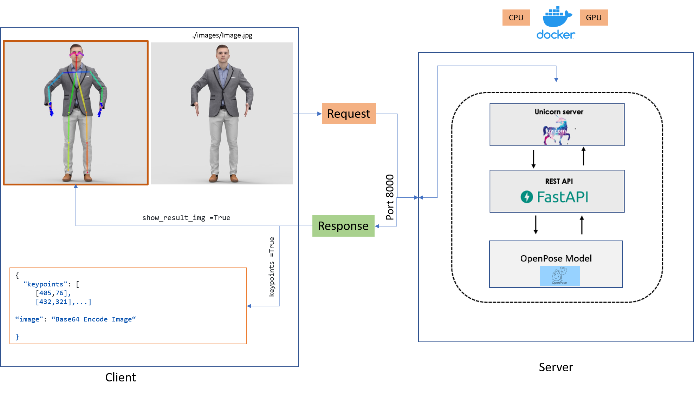

# openpose_service
OpenPose micro service implementation

<!-- TABLE OF CONTENTS -->
<details>
  <summary >Table of Contents</summary>
  <ol>
    <li>
      <a href="#about-the-project">About The Project</a>
      <ul>
        <li><a href="#built-with">Built With</a></li>
      </ul>
    </li>
    <li>
      <a href="#prerequisites">Prerequisites</a>
    </li>
    <li><a href="#inference">Inference</a>
       <ul>
        <li><a href="#direct-inference">Direct Inference </a></li>
        <li><a href="#docker-inference">Docker Inference</a></li>
        <li><a href="#sample-inference">Sample Inference</a></li>
       </ul>
    </li>
  </ol>
</details>

# **About The Project**

This project is a micro pose estimation service that uses the OpenPose model to perform pose estimation. Inference of images is performed using fastapi, a fast and simple microservice framework.

## **Built With**
The important frameworks/libraries used in this project are listed below.

* [Python](python.org/)
* [pytorch](https://pytorch.org/)
* [OpenCV](https://opencv.org/)
* [Docker](https://www.docker.com/)
* [fastapi](https://fastapi.tiangolo.com/)
* [OpenPose](https://github.com/CMU-Perceptual-Computing-Lab/openpose)


# **Prerequisites**

* Clone repository

    According to the following command, first clone the repository to 
  ```sh
  git clone https://github.com/virasad/openpose_service.git
  ```
    Go to openpose_service directory with the following command :
    ```sh
    cd openpose_service
    ```
Please copy pretrained model's of hand and body from [body link](https://drive.google.com/file/d/1ZH6eN9bO-IYAYv9XUyhOJ93u2rTKeXIM/view?usp=sharing) and [hand link](https://drive.google.com/file/d/1-hkvezkgkh_ZYRz-SN5mlQqAs65WZW9N/view?usp=sharingg) and copy them to the model directory.

# **Inference**

## **Direct Inference**

In this section we will describe how to perform inference directly. For using fastapi, uvicorn server is used. Steps are as follows.

1) Virtual environment

    Please as first step create a virtual environment. (as an example you can use conda command as follow)
    ```sh
    conda create -n venv_name python
    ```
  Note that venv_name would be your virtual environment name.

2) Activate virtual environment
    ```sh
    conda activate venv_name
    ```
3) Install packages

    for install packages use the following command
    ```sh
    pip install -r requirements.txt
    ```

4) Run server with following command in terminal:
    ```sh
    python main.py
    ```
5) For inference model with swagger gui which is available in fastapi by default, open http://127.0.0.1:8000/docs in your browser url. At the first, click on POST/inference button, and then click on try it out button. After that you can set your parameters (show_result_img(True or False) and keypoints(True or False)). After open image with image Browse button, run Execute button and you will see the result.
The results would be a json file including joints keypoints and base64 encoded image.
6) Also after running server, you can send POST request to server with following command in terminal:
  
    ```
    python send_request.py image_path
    ```
    where image_path is the path of your image.
    As an example, you can send request with following command
    ```sh
    python send_request.py ./images/image.jpg
    ```
Again the results that will be obtained, would be a json file including joints keypoints and base64 encoded image.
## **Docker Inference**

In this section we will describe how to perform inference using docker. Steps are as follows.

Download docker engine according to your OS. [Windows](https://desktop.docker.com/win/main/amd64/Docker%20Desktop%20Installer.exe?utm_source=docker&utm_medium=webreferral&utm_campaign=dd-smartbutton&utm_location=header) [Linux](https://hub.docker.com/search?offering=community&operating_system=linux&q=&type=edition) [Mac](https://hub.docker.com/editions/community/docker-ce-desktop-mac?utm_source=docker&utm_medium=webreferral&utm_campaign=dd-smartbutton&utm_location=header)

For use GPU in docker container, please install nvidia-docker and it's required tools. For more information please visit [nvidia-docker](https://nvidia.github.io/nvidia-docker/) and specially installation guide that is available in [installation-nvidia-docker](https://docs.nvidia.com/datacenter/cloud-native/container-toolkit/install-guide.html#docker)

After install docker engine, go to openpose_service directory with the following command :
```sh
cd openpose_service
```


* Build docker image
    ```sh
    docker build -t openpose_service .
    ```

* Run docker image
    ```sh
    docker run -p 8000:8000 openpose_service
    ```
After running docker image successfully, you can act as step 5 and 6 of [Direct Inference](#direct-inference) section.

2) For create a docker container which use your GPU hardware for inference, use docker-compse file as follow:
    ```sh
    docker compose up
    ```
    Be sure that you have installed docker compose plugin. For more information please visit [docker-compose](https://docs.docker.com/compose/install/)

    After running docker-compose, you can act as step 5 and 6 of [Direct Inference](#direct-inference) section.

## **Sample Inference**

  All steps of the inference are shown in the following figure.

  
 
